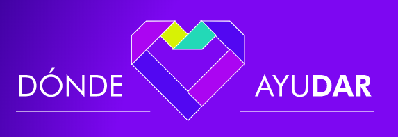
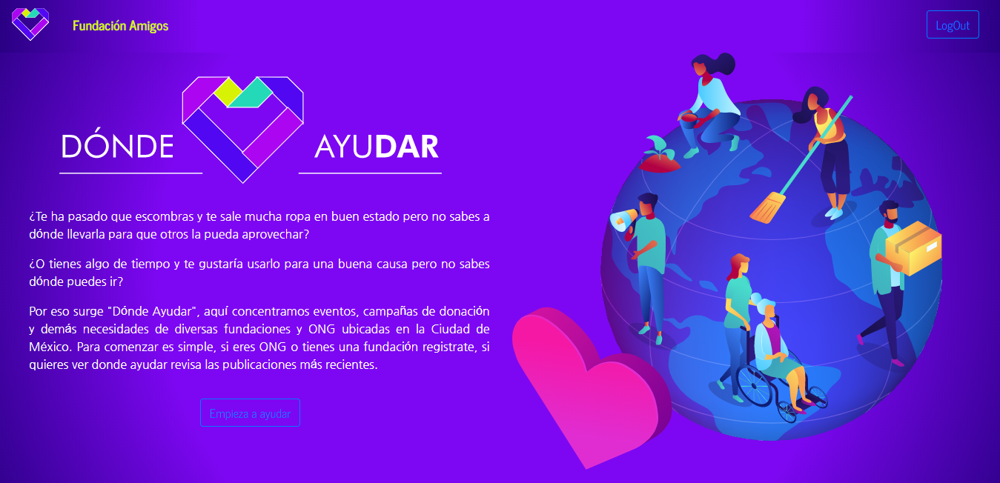
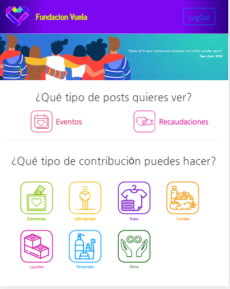
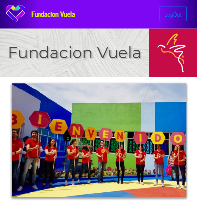
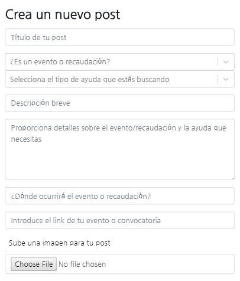

# Donde Ayudar

Donde Ayudar is a social network for non-profits in Mexico City that helps them create their own profile to connnect with volunteers and contributors and post their needs in real time. It also makes it easier for visitors to find their ideal way to contribute, by allowing them to filter posts by the type of help that is needed, like food, clothes, money and others. This benefits both the charity and the contributor, by helping them find each other more efficiently.

## Architecture

Donde Ayudar is developed with the MERN stack. The frontend framework is React. The API is built with Express, connecting with a MongoDB database. The app also icorporates Firebase for authentication and media storage.

## Built with

* React (Frontend framework)
* Express (API and server)
* MongoDB (Database)
* Bootstrap (Grid, spacing, nav and button styling)
* Firebase (User creation/authentication, media storage using cloud functions)
* React select (Component functionality in forms)
* React dates (Component functionality in forms)

## Usage

Donde Ayudar can be used in two ways. For owners of a non-profit or people who would like to contribute to one. The homepage will give you a brief explanation of the app. If you own a non-profit you should create a profile. If you want to contribute you can jump right away into browsing the posts.

Navigating the posts page will allow you to filter them depending on the contribution you would like to make.

If you created a non profit profile, you will be taken to your non-profit page. Here you can review your information and make a new post.

Making a new post is easy and allows you to specify the type of help you are looking for.

That's it!

## Demo

Click [here](https://dondeayudar.herokuapp.com) to launch a deployed version of the app.

## Authors

* **[Vianey Cadena](https://github.com/VianeyCadena)** - Main designer. Logo, icons, illustrations. Components style.
* **[Isabela Rabasa](https://github.com/isarabasa)** - Frontend programming, user and post pages. Components style.
* **[Fran Cuesta](https://github.com/IscoCuesta)** - User experience and app mockup. Firebase authentication.
* **[Edgar Chávez](https://github.com/edgar821)** - Database design, API. Connecting API with components. Cloud functions.